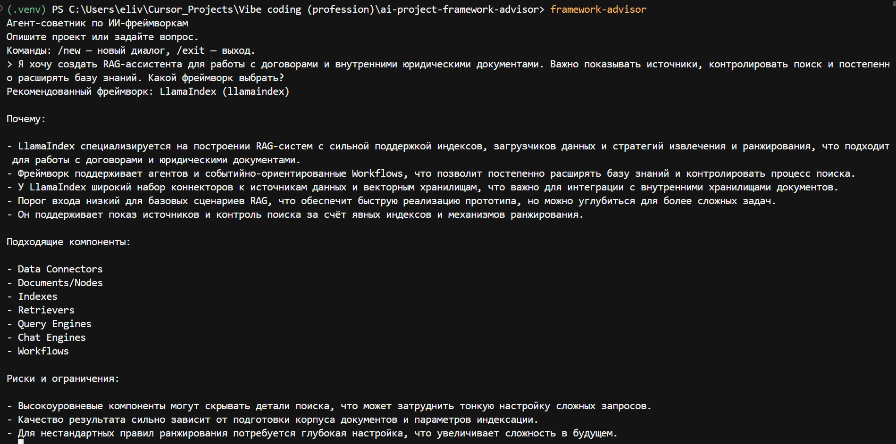
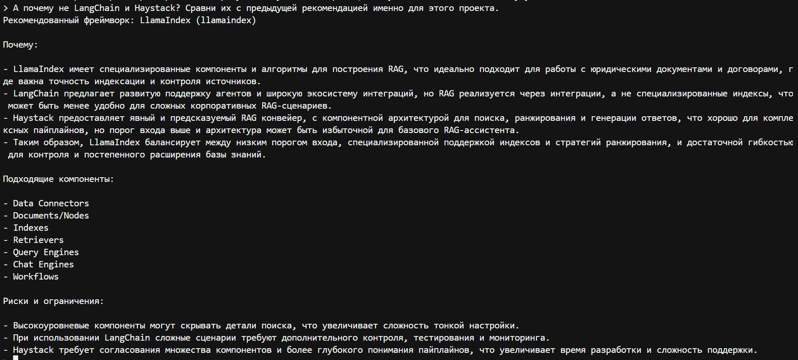
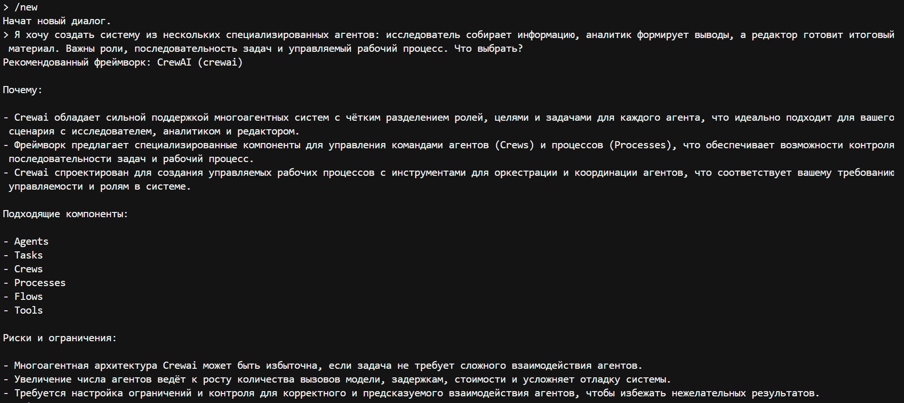
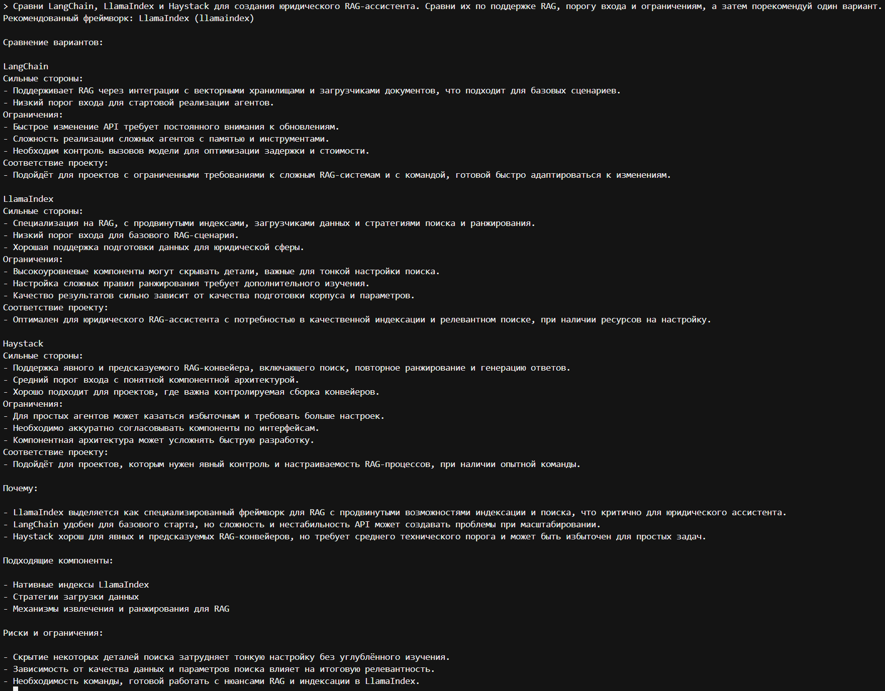
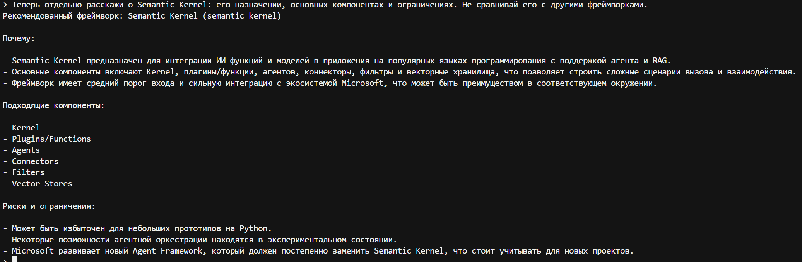
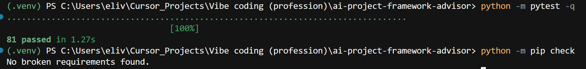

# AI Project Framework Advisor

Учебный LangChain-агент, который анализирует требования ИИ-проекта, сравнивает фреймворки и рекомендует подходящий вариант.

`Python 3.12+` `LangChain` `224 tests passed` `Educational project`

## О проекте

Агент принимает текстовое описание ИИ-проекта и помогает выбрать фреймворк для его построения. Он:

- рассматривает пять фреймворков: LangChain, LlamaIndex, Haystack, Semantic Kernel и CrewAI;
- использует локальную базу характеристик фреймворков, а не догадки модели: рекомендация принимается только после успешного вызова локального инструмента данных в текущем запросе (см. «Проверка ответа локальными данными»);
- вызывает собственные инструменты для получения фактов;
- возвращает структурированную рекомендацию (Pydantic-схема), а не произвольный текст;
- поддерживает краткосрочную память диалога в рамках запущенного процесса.

Проект создан как дополнительная часть домашнего задания по фреймворкам управления памятью и контекстом.

## Возможности

- рекомендации по выбору фреймворка под описанный проект;
- явное сравнение нескольких вариантов (поле `comparison` в ответе);
- получение отдельного профиля одного фреймворка;
- два собственных инструмента:
  - `get_framework_profile` — профиль одного фреймворка;
  - `compare_frameworks` — сравнение от двух до пяти фреймворков по выбранным критериям;
- структурированный ответ через Pydantic (`AdvisorResponse`);
- детерминированная проверка ответа: без успешного вызова инструмента данных в текущем запросе рекомендация отклоняется;
- краткосрочная память через `InMemorySaver` и `thread_id`;
- команды CLI `/new`, `/exit`, `/quit`; справка `framework-advisor -h` / `--help`;
- обработка ошибок структурированного ответа и обычных сбоев модели или сети без вывода traceback и текста исключения пользователю;
- автоматические тесты, не выполняющие реальных API-вызовов.

## Поддерживаемые фреймворки

| Фреймворк | Основной фокус |
| --- | --- |
| LangChain | Агенты, инструменты и многошаговые сценарии |
| LlamaIndex | Документы, собственные данные и RAG |
| Haystack | Компонентные поисковые и RAG-конвейеры |
| Semantic Kernel | ИИ-функции, плагины и Microsoft-экосистема |
| CrewAI | Команды специализированных агентов и управляемые процессы |

Ни один из вариантов не является универсально лучшим — выбор зависит от конкретного проекта.

## Архитектура

```text
ai-project-framework-advisor/
├── src/advisor/
│   ├── framework_data.py
│   ├── tools.py
│   ├── schema.py
│   ├── grounding.py
│   ├── agent.py
│   └── cli.py
├── tests/
├── docs/evidence/
├── .env.example
├── pyproject.toml
└── README.md
```

- `framework_data.py` — локальный словарь с профилями пяти фреймворков, критериями сравнения и их подписями. Единый источник данных для инструментов.
- `tools.py` — два собственных инструмента (`get_framework_profile`, `compare_frameworks`), нормализация названий фреймворков и критериев.
- `schema.py` — Pydantic-модели `AdvisorResponse` и `FrameworkComparison`, описывающие структуру финального ответа агента.
- `grounding.py` — проверка ответа после выполнения агента: был ли в текущем запросе успешный вызов локального инструмента данных и согласуются ли рекомендация, компоненты и сравнение с этими данными.
- `agent.py` — сборка агента через `create_agent`: модель, инструменты, системный промпт, `response_format`, `checkpointer`.
- `cli.py` — консольный интерфейс: цикл диалога, форматирование ответа, обработка команд и ошибок, справка.

## Как работает агент

1. Пользователь описывает проект в консоли.
2. Агент определяет разумных кандидатов среди поддерживаемых фреймворков.
3. Агент вызывает `get_framework_profile` (один фреймворк) или `compare_frameworks` (несколько вариантов).
4. Инструменты получают данные только из `framework_data.py`, не выдумывая характеристики.
5. Модель формирует ответ в виде `AdvisorResponse`.
6. `grounding.py` проверяет ответ по следу текущего запроса: если успешного вызова инструмента данных не было или ответ не согласуется с его результатами, рекомендация отклоняется и не выводится.
7. CLI выводит принятую рекомендацию, сравнение вариантов (если есть), причины, подходящие компоненты и риски.
8. `InMemorySaver` сохраняет состояние диалога по `thread_id` в рамках текущего процесса.

`InMemorySaver` не является долгосрочной памятью и не сохраняет историю после завершения программы.

## Проверка ответа локальными данными

LangChain делает инструменты доступными, но не заставляет модель их вызывать: модель может вернуть валидный `AdvisorResponse` и без обращения к локальной базе. Поэтому после выполнения агента CLI детерминированно проверяет ответ (`grounding.py`), и такая рекомендация «только от модели» отклоняется.

Проверяется только текущий запрос — сообщения после последнего сообщения пользователя. Успешный вызов инструмента из предыдущих реплик диалога остаётся в `InMemorySaver`, но новый ответ не подтверждает: в каждом запросе инструмент нужно вызвать заново, в том числе в уточняющих вопросах.

Ответ принимается, если:

- в текущем запросе есть успешный вызов `get_framework_profile` или `compare_frameworks` и соответствующий ему успешный результат (`ok: true`); вызов, вернувший ошибку, и служебный вызов структурированного ответа не считаются;
- трасса этих вызовов однозначна: на каждый вызов приходится ровно один результат с тем же `tool_call_id` и тем же именем инструмента, идущий после вызова; нет результата, дублей или чужого результата — ответ отклоняется;
- успешный результат имеет полную структуру, которую возвращает сам инструмент, и совпадает с локальными данными: профиль — с сохранённым профилем фреймворка, сравнение — от 2 до 5 разных фреймворков с ожидаемыми критериями, подписями и значениями; неполный или искажённый результат отклоняется;
- `recommended_framework` входит в число фреймворков из этих результатов;
- каждый элемент `suitable_components` есть в `typical_components` локального профиля рекомендованного фреймворка (регистр, лишние пробелы, `_` и `-` не важны; допускаются части составных названий, например `Nodes` из `Documents/Nodes`);
- если `comparison` не пуст: фреймворки в нём не повторяются, рекомендованный фреймворк входит в сравнение, а набор фреймворков совпадает с теми, которые сравнил `compare_frameworks` в текущем запросе. Пустой `comparison` допустим и для проверки не создаётся.

Границы проверки: она сверяет ответ только с фактами, которые представлены локальными профилями и результатами инструментов. Текст `strengths`, `limitations`, `fit_for_project`, `reasoning` и `risks` не проверяется, общая фактическая корректность не гарантируется. Отклонённый запрос остаётся в истории диалога текущего процесса.

## Структурированный ответ

Упрощённый пример `AdvisorResponse`:

```json
{
  "recommended_framework": "llamaindex",
  "comparison": [
    {
      "framework": "langchain",
      "strengths": ["..."],
      "limitations": ["..."],
      "fit_for_project": "..."
    }
  ],
  "reasoning": ["..."],
  "suitable_components": ["..."],
  "risks": ["..."]
}
```

## Установка

```powershell
git clone https://github.com/eliv1982/ai-project-framework-advisor.git
cd ai-project-framework-advisor
py -3.12 -m venv .venv
.\.venv\Scripts\Activate.ps1
python -m pip install --upgrade pip
python -m pip install -e ".[dev]"
```

## Настройка переменных окружения

```powershell
Copy-Item .env.example .env
```

Содержимое `.env`:

```dotenv
OPENAI_API_KEY=your_api_key_here
OPENAI_MODEL=gpt-4.1-mini
```

Не публикуйте `.env`. Не добавляйте API-ключ в README, скриншоты или коммиты. Файл `.env` уже исключён через `.gitignore`.

## Запуск

```powershell
framework-advisor
```

Справка (не требует `OPENAI_API_KEY`):

```powershell
framework-advisor --help
```

Пример запроса в диалоге:

```text
Сравни LangChain, LlamaIndex и Haystack для создания юридического RAG-ассистента. Сравни их по поддержке RAG, порогу входа и ограничениям, а затем порекомендуй один вариант.
```

Команды интерфейса:

- `/new` — начать новый диалог;
- `/exit` или `/quit` — завершить программу.

## Тестирование

```powershell
python -m pytest -q
python -m pip check
```

Тесты используют детерминированную фейковую модель вместо реального провайдера; сетевые вызовы OpenAI не выполняются.

Текущий результат:

```text
224 passed
No broken requirements found.
```

## Демонстрация

Скриншоты сняты до добавления проверки ответа локальными данными; формат вывода при этом не изменился. Снимок тестов показывает прежний набор из 81 теста.



Рекомендация для юридического RAG-ассистента.



Продолжение диалога с учетом предыдущего контекста.



Новый диалог и рекомендация CrewAI для многоагентного сценария.



Явное сравнение LangChain, LlamaIndex и Haystack.



Отдельный профиль Semantic Kernel.



Результаты автоматических тестов и проверки зависимостей.

## Учебные ограничения

- характеристики фреймворков хранятся в локальном словаре, поддерживаются вручную, не обновляются автоматически и могут устареть;
- проверка ответа детерминированная и ограничена локальными данными: общая фактическая корректность рекомендаций не гарантируется;
- проверка строгая (например, набор `comparison` должен совпасть с набором, сравнённым инструментом), поэтому корректный по смыслу ответ иногда может быть отклонён — тогда запрос можно повторить;
- `InMemorySaver` работает только в рамках процесса;
- CLI рассчитан на одного локального пользователя;
- нет постоянной базы истории диалогов;
- нет повторных попыток при сетевых ошибках: при сбое выводится общее сообщение;
- нет LangSmith или другой производственной наблюдаемости;
- рекомендации агента требуют человеческой проверки перед архитектурным решением.

## Технологии

- Python 3.12+
- LangChain
- LangGraph
- langchain-openai
- Pydantic 2
- python-dotenv
- pytest
- Hatchling
